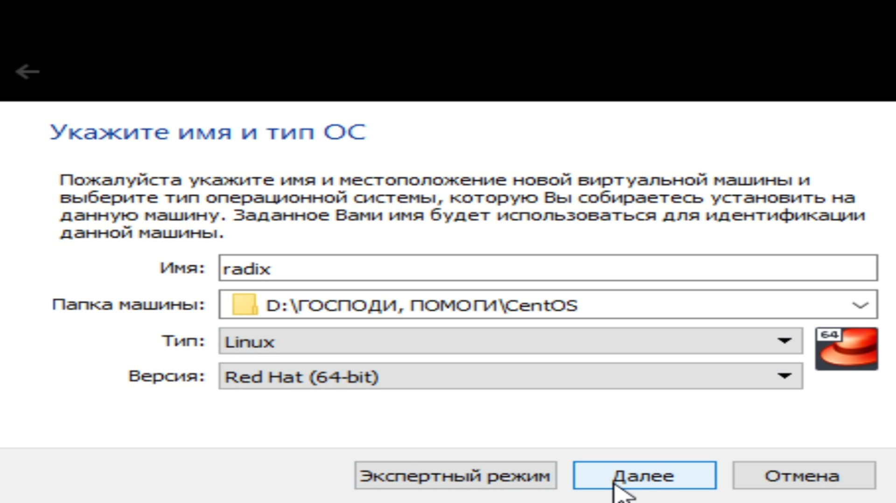
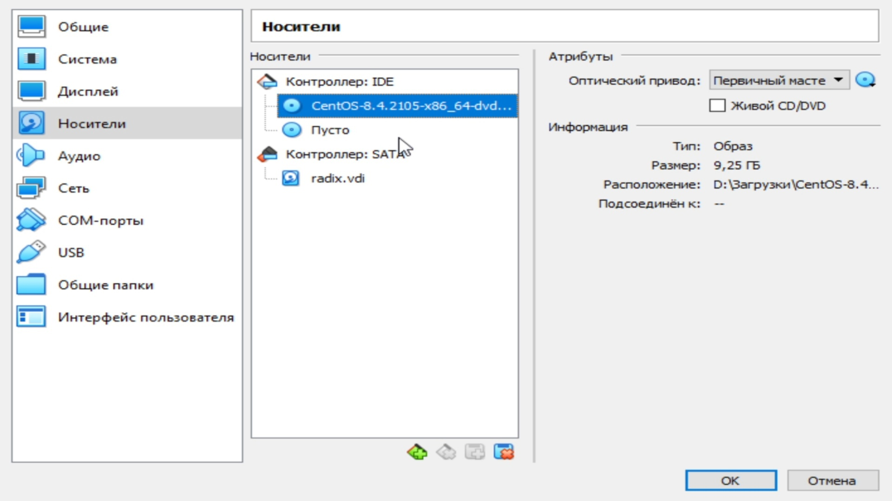
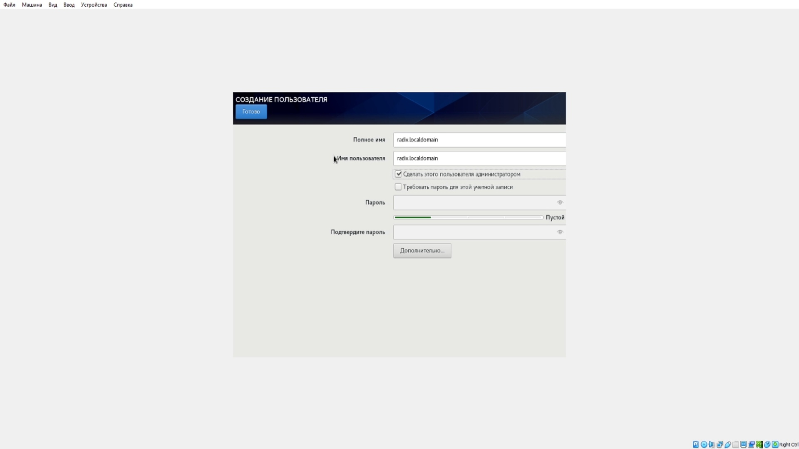

---
## Front matter
title: Лабораторная работа №3. Модель боевых действий
author: [Радикорский Павел Михайлович, НФИбд-03-18]
institute: "RUDN University, Moscow, Russian Federation"
date: 17.09.2021
lang: "ru"
## Formatting
toc: false
slide_level: 2
theme: metropolis
mainfont: PT Serif
romanfont: PT Serif
sansfont: PT Sans
monofont: Consolas
header-includes:
 - \metroset{progressbar=frametitle,sectionpage=progressbar,numbering=fraction}
 - '\makeatletter'
 - '\beamer@ignorenonframefalse'
 - '\makeatother'
aspectratio: 43
section-titles: true

---
# Цели и задачи

## Цель

Приобретение практических навыков установки операционной системы на виртуальную машину, настройки минимально необходимых для
дальнейшей работы сервисов.

## Задачи

Лабораторная работа подразумевает установку на виртуальную машину VirtualBox (https://www.virtualbox.org/) операционной системы
Linux, дистрибутив Centos.

# Выполнение

## Процесс выполнения

Загрузим образ установки операционной системы, запустим VirtualBox, начнём создавать новую виртуальную машину. Укажем имя, тип и расположение ОС
    
{ #fig:001 width=70% }

## Процесс выполнения

Укажем необходимый объём оперативной памяти
    
{ #fig:001 width=70% }

## Процесс выполнения

Установим параметры виртуального жёсткого диска. Взяли объём 40ГБ

{ #fig:001 width=70% }

## Процесс выполнения

В VirtualBox добавили в носите виртуальной машины новый привод оптических дисков с нашим образом.

{ #fig:001 width=70% }

## Процесс выполнения

Запустили виртуальную машину, приступили к установке ОС, выбрали необходимые параметры установки

{ #fig:001 width=70% }

## Процесс выполнения

Создали пользователя, выбрали вариант установки

{ #fig:001 width=70% }

## Процесс выполнения

{ #fig:001 width=70% }

## Процесс выполнения

Завершили установку ОС, запустили терминал, обновили системные файлы

{ #fig:001 width=70% }

## Процесс выполнения

Освободили жёсткий диск для множественного подключения

{ #fig:001 width=70% }

## Процесс выполнения

Создали новую виртуальную машину с использованием имеющегося виртуального жёсткого диска

{ #fig:001 width=70% }

# Выводы

Приобрели навыки установки операционной системы в виртуальной машине, изучили конфигурации ОС и виртуальных машин