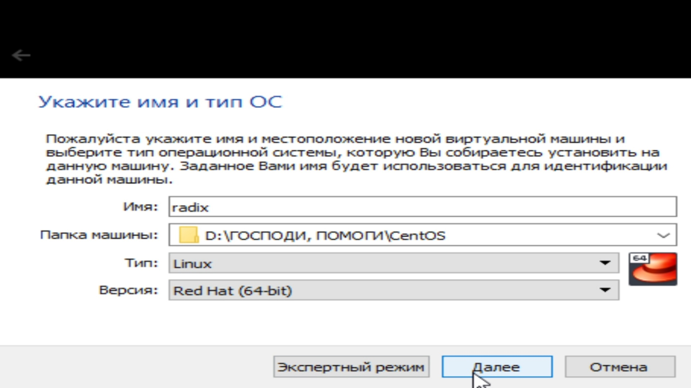
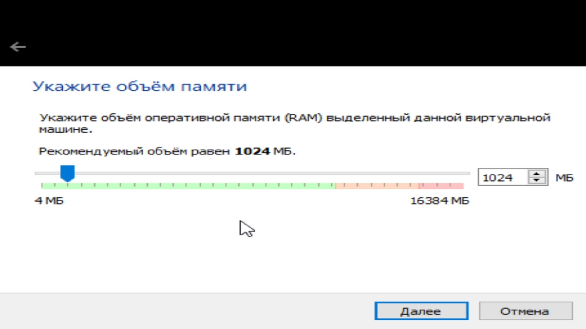
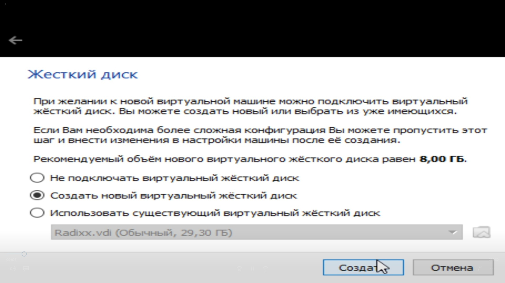
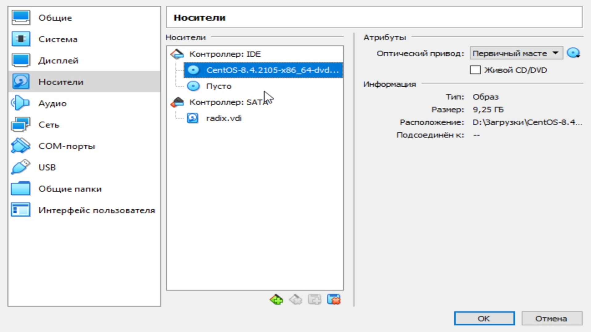
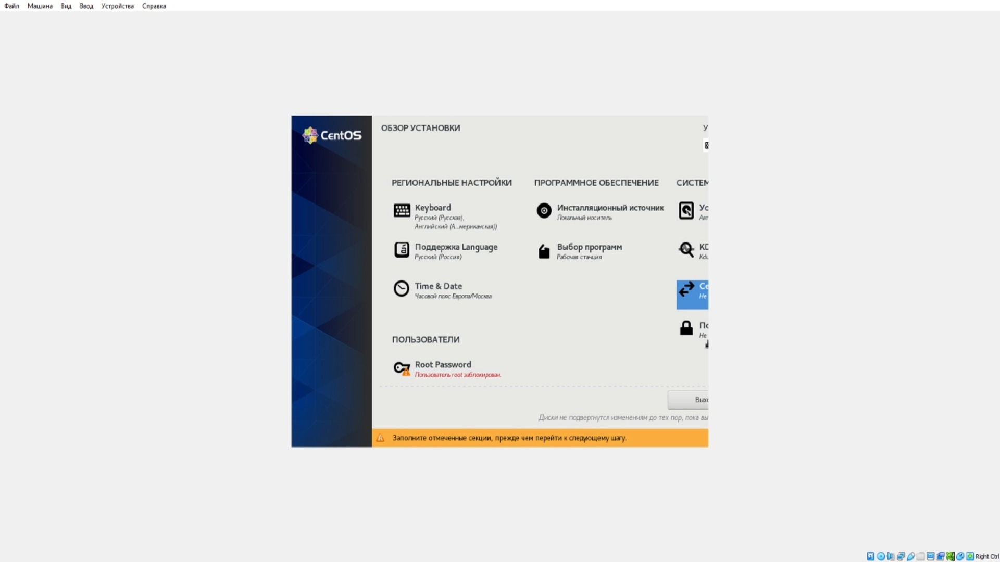
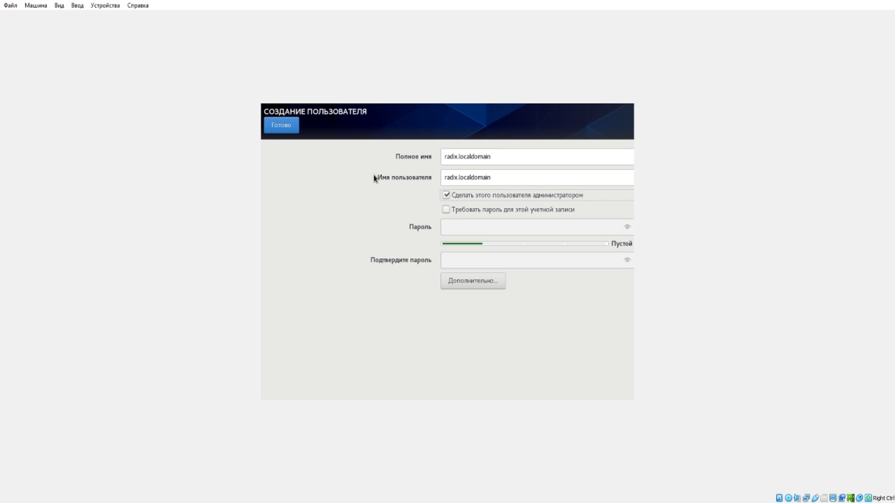
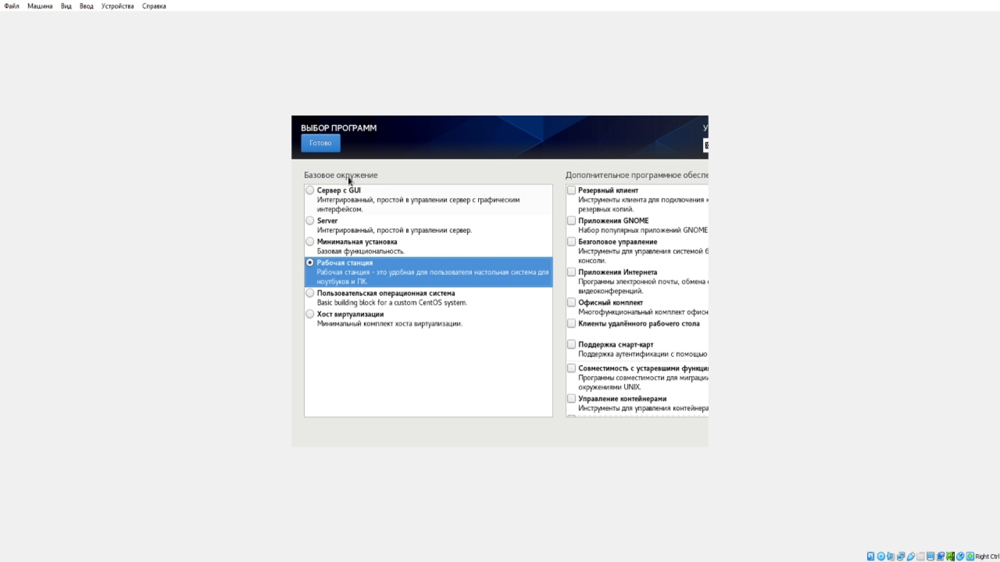
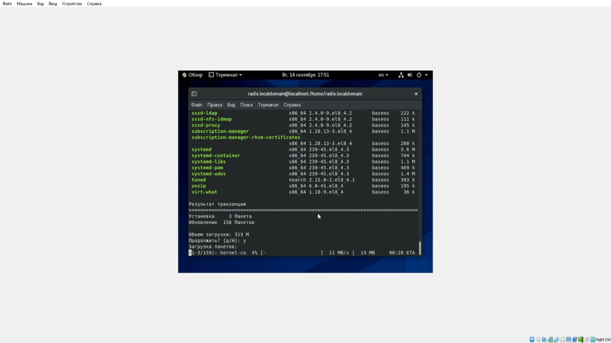
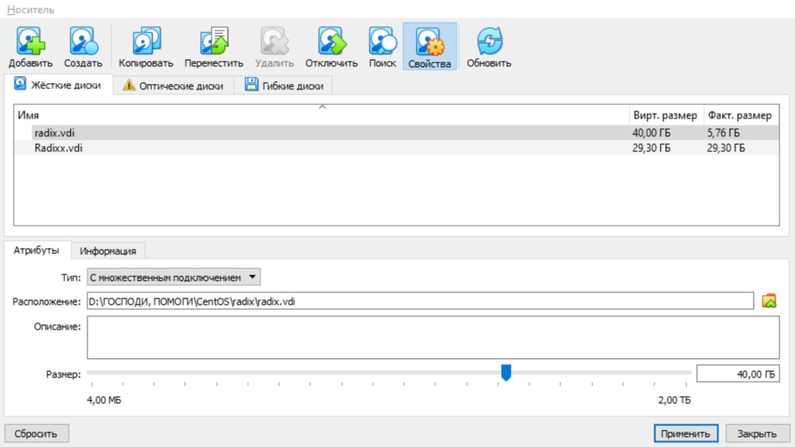
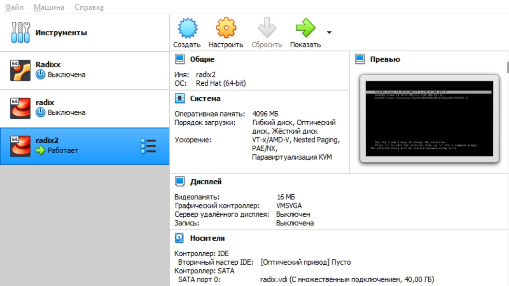

---
title: "Лабораторная работа №1. Установка и конфигурация операционной системы на виртуальную машину"
author: [Радикорский Павел Михайлович, НФИбд-03-18]
institute: "RUDN University, Moscow, Russian Federation"
date: "17.09.2021"
keywords: [Безопасность, Лабораторная]
lang: "ru"
toc-title: "Содержание"
toc: true # Table of contents
toc_depth: 2
lof: true # List of figures
fontsize: 12pt
mainfont: PT Serif
romanfont: PT Serif
sansfont: PT Sans
monofont: Consolas
mainfontoptions: Ligatures=TeX
romanfontoptions: Ligatures=TeX
sansfontoptions: Ligatures=TeX,Scale=MatchLowercase
monofontoptions: Scale=MatchLowercase
titlepage: true
titlepage-text-color: "000000"
titlepage-rule-color: "000000"
titlepage-rule-height: 0
listings-no-page-break: true
indent: true
header-includes:
  - \usepackage{sectsty}
  - \sectionfont{\clearpage}
  - \linepenalty=10 # the penalty added to the badness of each line within a paragraph (no associated penalty node) Increasing the value makes tex try to have fewer lines in the paragraph.
  - \interlinepenalty=0 # value of the penalty (node) added after each line of a paragraph.
  - \hyphenpenalty=50 # the penalty for line breaking at an automatically inserted hyphen
  - \exhyphenpenalty=50 # the penalty for line breaking at an explicit hyphen
  - \binoppenalty=700 # the penalty for breaking a line at a binary operator
  - \relpenalty=500 # the penalty for breaking a line at a relation
  - \clubpenalty=150 # extra penalty for breaking after first line of a paragraph
  - \widowpenalty=150 # extra penalty for breaking before last line of a paragraph
  - \displaywidowpenalty=50 # extra penalty for breaking before last line before a display math
  - \brokenpenalty=100 # extra penalty for page breaking after a hyphenated line
  - \predisplaypenalty=10000 # penalty for breaking before a display
  - \postdisplaypenalty=0 # penalty for breaking after a display
  - \floatingpenalty = 20000 # penalty for splitting an insertion (can only be split footnote in standard LaTeX)
  - \raggedbottom # or \flushbottom
  - \usepackage{float} # keep figures where there are in the text
  - \floatplacement{figure}{H} # keep figures where there are in the text
...

# Цели и задачи

**Цель:** Приобретение практических навыков установки операционной системы на виртуальную машину, настройки минимально необходимых для
дальнейшей работы сервисов.

**Задачи:**

Лабораторная работа подразумевает установку на виртуальную машину VirtualBox (https://www.virtualbox.org/) операционной системы
Linux, дистрибутив Centos.

# Теоретическая справка

CentOS — дистрибутив Linux, основанный на коммерческом Red Hat Enterprise Linux компании Red Hat и совместимый с ним.

№ Выполнение

Загрузим образ установки операционной системы, запустим VirtualBox, начнём создавать новую виртуальную машину. Укажем имя, тип и расположение ОС
    
{ #fig:001 width=70% }

Укажем необходимый объём оперативной памяти
    
{ #fig:001 width=70% }

Установим параметры виртуального жёсткого диска. Взяли объём 40ГБ

{ #fig:001 width=70% }

В VirtualBox добавили в носите виртуальной машины новый привод оптических дисков с нашим образом

{ #fig:001 width=70% }

Запустили виртуальную машину, приступили к установке ОС, выбрали необходимые параметры установки

{ #fig:001 width=70% }

Создали пользователя, выбрали вариант установки

{ #fig:001 width=70% }

{ #fig:001 width=70% }

Завершили установку ОС, запустили терминал, обновили системные файлы

{ #fig:001 width=70% }

Освободили жёсткий диск для множественного подключения

{ #fig:001 width=70% }

Создали новую виртуальную машину с использованием имеющегося виртуального жёсткого диска

{ #fig:001 width=70% }

#  Выводы

Приобрели навыки установки операционной системы в виртуальной машине, изучили конфигурации ОС и виртуальных машин